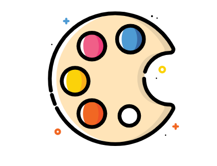
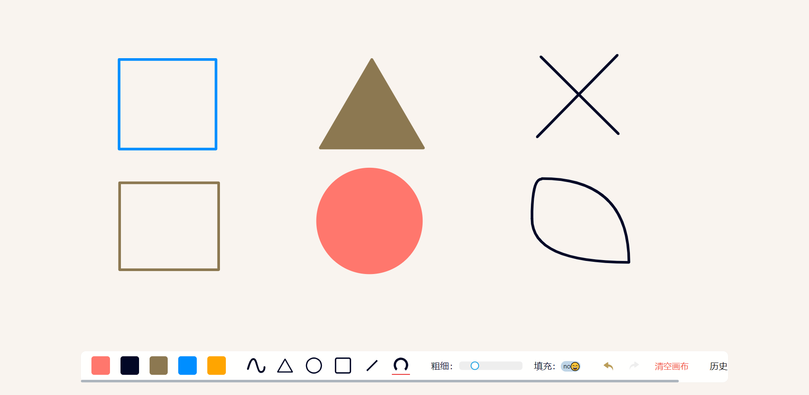
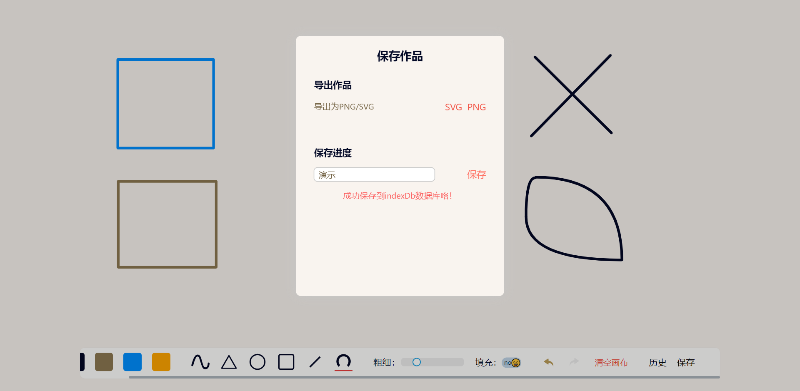
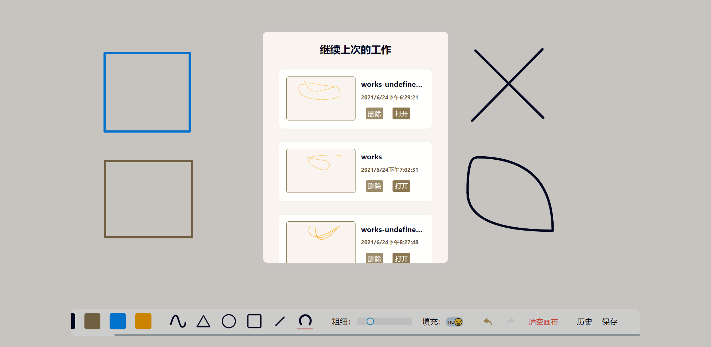

# 前端画板（基于 React 和 SVG）

可以绘制各种图形，包括圆形、矩形、三角形、直线、弧线；可以设置图形轮廓线颜色、宽度；可以填充封闭图形，填充可选择颜色，图形可重叠。可以保存绘制内容到浏览器储存。具有撤销、恢复功能。

<p align="center">
  <a href="https://github.com/kfyidrig/svg-drawing-board">
    
  </a>
  <h3 align="center">前端画板（基于React和SVG）</h3>
  <p align="center">
    可以绘制各种图形，包括圆形、矩形、三角形、直线、弧线
    <br /><br />
    <a href="https://drawing.ieleven.xyz" target="_blank">查看Demo</a>
    ·
    <a href="https://github.com/kfyidrig/svg-drawing-board/issues">报告Bug</a>
    ·
    <a href="https://github.com/kfyidrig/svg-drawing-board/issues">提出新特性</a>
  </p>

## 目录

- [屏幕截图](#屏幕截图)
- [上手指南](#上手指南)
  - [环境要求](#开发前的配置要求)
  - [安装步骤](#安装步骤)
- [文件目录说明](#文件目录说明)
- [开发的架构](#开发的架构)
- [部署](#部署)
- [使用到的框架](#使用到的框架)
- [版本控制](#版本控制)
- [作者](#作者)

### 屏幕截图

1. 主界面，绘画界面，底部工具栏支持鼠标滚轮滚动，对触屏滑动进行了优化

   

2. 保存绘画和导出绘画 Modal，支持导出 SVG\PNG 两种格式，支持储存到 indexDb

   

3. 历史记录，可以查看、打开和删除（删除时无提示）过去保存的绘图

   

### 上手指南

打开网页即可食用，支持触屏操作，也能通过鼠标来绘制

###### 环境要求

1. Node.js（尽量新的版本）
2. 最好使用 chrome、safari 或 firefox

###### **安装步骤**

1. 克隆本项目源码

   ```shell
   git clone https://github.com/kfyidrig/svg-drawing-board.git
   ```

2. 按照项目依赖

   ```shell
   yarn
   #如果你没安装yarn，请先安装yarn
   ```

3. 在浏览器预览

   ```shell
   yarn start
   ```

4. 打包生成成品

   ```shell
   yarn run build
   #build目录即可看到成品
   ```

### 文件目录说明

暂无

### 部署

暂无

### 使用到的框架

- [react](https://react.docschina.org/)

### 贡献者

请阅读**CONTRIBUTING.md** 查阅为该项目做出贡献的开发者。

### 版本控制

该项目使用 Git 进行版本管理。您可以在 repository 参看当前可用版本。

### 作者

liucan@ieleven.xyz

_您也可以在贡献者名单中参看所有参与该项目的开发者。_

### 版权说明

该项目签署了 MIT 授权许可，详情请参阅 [LICENSE.txt](https://github.com/shaojintian/Best_README_template/blob/master/LICENSE.txt)
